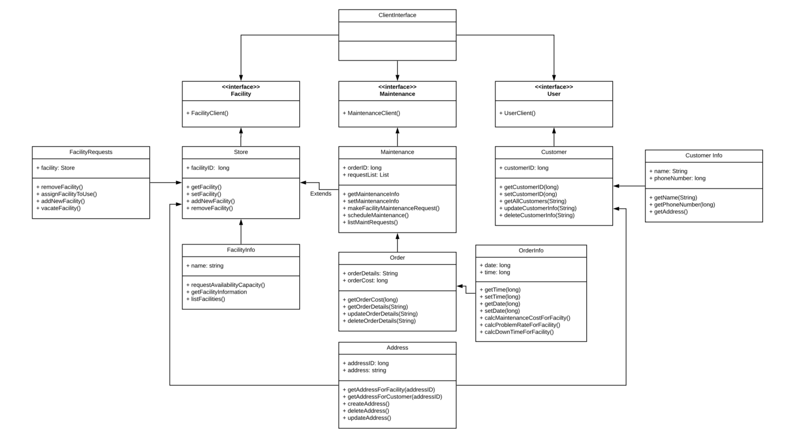

# COMP 373 - Facility of the Jollibee Food Chain
## What It Is
Project 1 for COMP 373. Building a Facility structure for the Jollibee Fast Food Chain.
### How to Run:
Run as a Java application in order to view unit test results 
## UML Diagram

